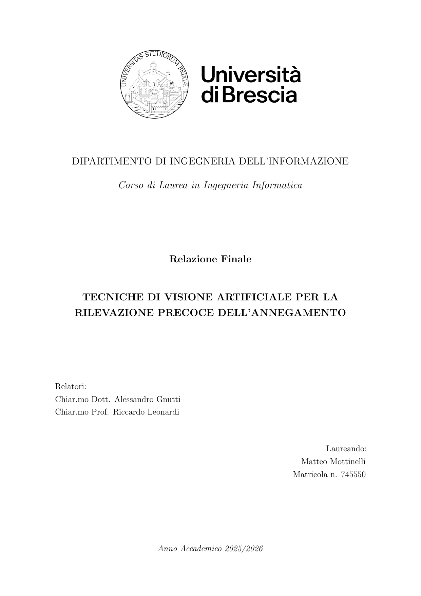

  

# Tecniche di visione artificiale per la rilevazione precoce dell'annegamento

Relazione finale del Corso di Laurea in Ingegneria Informatica, Dipartimento di Ingegneria dell'Informazione, Università degli Studi di Brescia.

**Laureando:** Matteo Mottinelli (matricola 745550)  
**Relatori:** Alessandro Gnutti e Riccardo Leonardi  
**Anno accademico:** 2025/2026

Il documento completo è disponibile in [main.pdf](main.pdf).
